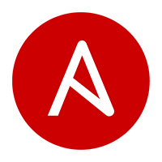

# Technical-Assessment
```json
Technical Assessment Answers for DevOps Position
```
<div>


</div>


## ANSWERS
**1-) Describe / design the perfect automation pipeline using Jenkins. Look for what is included in the pipeline, DevSecOps, Code checks, Functional testing, Performance testing, release sign off.**

```json
Something here
```

**2-) Create a sample IaaC template using Terraform to provision a single server in availability zone a, with a 20gb operating system volume, and a 100g locally attached data volume. The server will be used to calculate complex equations.**
```json
Please find the related project attached : https://github.com/hknerts/Technical-Assessment/tree/master/Answer%202%20-%20Terraform
```
**3-) Using ansible, create a sample playbook to install Oracle Java onto a Linux host.**
```json
Please find the related project attached : https://github.com/hknerts/Technical-Assessment/tree/master/Answer%203%20-%20Ansible
```
**4-) In Unix, how do you find which process is using a file ?**
You can find which process is using a file with fstat command in Unix. For example, to find which proces is using 'example.txt', we can execute  below command.
```json
fstat example.txt
```
**5-) How would you run a SQL command in your script? Provide a sample script ?**
We can execute sql script with sql plus like below.
```json
CONNECTION_STATEMENT="$USERNAME/$PASSWORD@$SERVICE"

OUTPUT=$(sqlplus -s $CONNECTION_STATEMENT <<-END-OF-SQL
           select t.column from table t;
exit;
END-OF-SQL)
echo "COMPLETED GATHER STATS $OUTPUT";
```
**6-) How would you go about showing non-printable characters in a text file ?**
We can use 'cat' with '-v' option for non-printable characters. For example :
```json
cat -v example.txt
```
**7-) Name five important DevOps tools that organizations should consider adopting when undergoing a DevOps transition ?**
```json
• Terraform (for provisioning resources of all providers)
• - GitLab CI/CD - or  - Jenkins and Git -  (for SCM and CI/CD pipelines)
• Docker (Container)
• Kubernetes (Container Orchestration)
• Ansible (for Configuration Management)
```
**8-) What does it mean to shift left in DevOps ?**
```json
Shift left means performing all the verification and validation activities as soon as possible, before the release sign off.
In that way, we have a chance to detect any weakness of the product in early stages of SDLC and take preventive actions. 
The main goal is reduce possibility of unpleasant surprises at the end of the development cycle.
```
**9-) What are the prerequisites for the implementation of DevOps ?**
```json
• The company culture, quality mindset, product requirements.
• A thorough road map and flexible team for common goal.
• Providing and planning time for analysis and development of product
```
**10-) What are the fundamental differences between DevOps & Agile ?**
```json
• Agile refers to an iterative approach which focuses on collaboration, customer feedback, and small, rapid releases. 
  DevOps is considered as a practice of bringing development and operation teams together. 
• In Agile , feedbacks are given by the customer. In DevOps, feedbacks are given by internal team.
• Agile process focuses on changes. DevOps focuses on testing and delivery.
```
